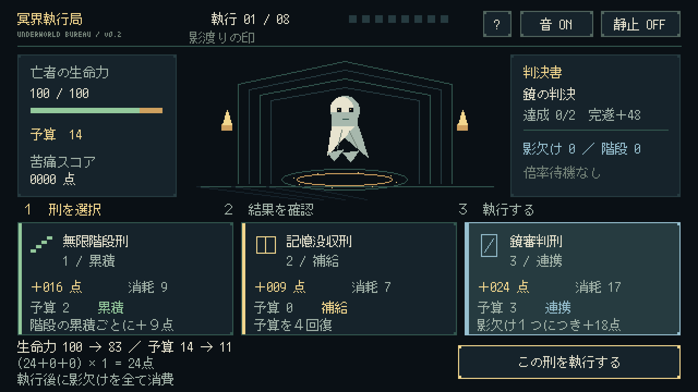

# 冥界執行局 — Underworld Execution Rogue

Pyxel製の架空処刑ローグライト v0.2。
冥界の執行官として、刑・印章・判決書を組み合わせ、8手番の苦痛スコアを競います。

## ブラウザ版

ソース・配布ファイル・検証記録は、このGitHubリポジトリで管理します。
`index.html` にブラウザ版を同梱しています。

GitHub Pagesの公開設定後のURL：
[冥界執行局を開く](https://jirodasu.github.io/underworld-execution-rogue/)

公開設定：リポジトリの **Settings → Pages → Build and deployment** で
**Deploy from a branch → main → / (root) → Save** を選択します。
公開設定の有効化と公開URLでの起動は未確認です。

スマートフォンは横持ち。初回のCLICK TO STARTを押すと起動します。
同梱ページはPyxel 2.5.7を固定して使用します。

確認用ブラウザではOpenGL初期化エラーのため実プレイ未完了。ネイティブ描画と入力を通した5回の自動プレイは完了。

## 操作

- カードをタップ／クリックで選択し、執行ボタンで決定。
- キーボードは1・2・3／左右で選択、Enter／Spaceで決定。
- H／?で手引き、Mで音切替、Vで静止表示切替。
- 結果画面はRで同じ条件、Enterで新しい条件の挑戦。

## ルール

開始時に印章を1つ選択。生命力100・予算14から開始。
各手番で3枚から刑を選択。4手番後に追加印章で構成を強化します。
生命力0で終了。8手番完遂なら40＋残存生命力の半分を加点。
判決書の条件を満たして完遂すると追加48点。
影→鏡、鐘→次の刑、階段の累積で得点を伸ばします。
記憶没収は予算を補給。毎回提示され、予算不足で進行不能にはなりません。
同条件の再挑戦では判決書と提示順が再現され、印章と選択を変えて攻略できます。
最高記録はブラウザ内またはデスクトップのローカルファイルに保存します。
オンラインランキング・Steam販売版は未実装。

## Windowsで開発

```powershell
py -m pip install -r requirements.txt
py game/main.py
py -m unittest discover -s tests
py tools/build_fonts.py
py -m pyxel package game game/main.py
py tools/build_web.py
```

`index.html` と `game.pyxapp` が配布ファイルです。
更新時はソースと再生成した配布ファイルを同じコミットで反映します。
GitHub Pagesを上記の設定にした場合、`main` の更新で公開版も更新されます。

## 検証・仕様

- [ゲーム仕様](docs/DESIGN.md)
- [品質レビュー・5回のプレイ記録](docs/QUALITY_REVIEW.md)
- `tools/playtest.py`：実Pyxel描画とキー注入を通した5回の自動プレイ
- `tests/`：得点・進行・保存の自動テスト
- `docs/qa/`：選択の全記録・画面画像



刑・亡者・苦痛値はフィクションです。
日本語フォントはM+ bitmap fonts由来。ライセンスは `game/assets/FONT_LICENSE.txt`。
