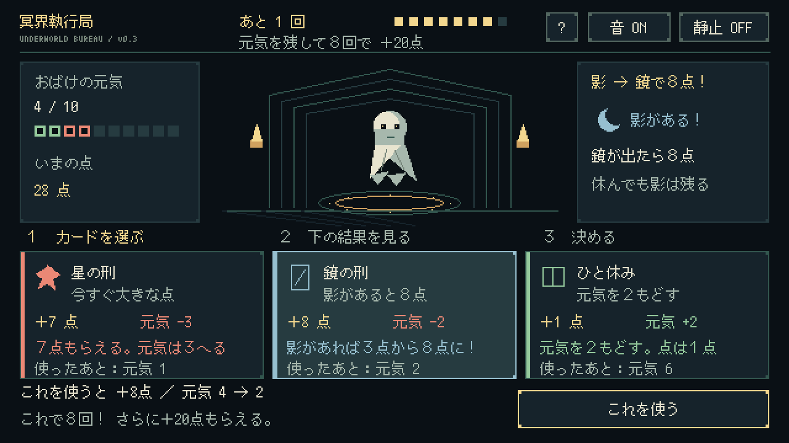

# 冥界執行局 — Underworld Execution Rogue

Pyxel製の架空処刑ローグライト v0.3。執行官として、不思議な刑を選ぶゲームです。

[ブラウザで遊ぶ](https://jirodasu.github.io/underworld-execution-rogue/)

スマートフォンは横持ち。最初の **CLICK TO START** をタップします。

## あそびかた

1. ３枚から１枚選ぶ。下に出る点と元気を見て「これを使う」。
2. おばけの元気を残して、８回選ぶ。
3. 高い点をめざす。元気を残して８回できたら **＋20点！**

元気は10からスタート。０になると、その場で終わります。８回目でも０ならボーナスはありません。

| カード | 点 | 元気 | 特徴 |
|---|---:|---:|---|
| 影の刑 | 2 | −1 | 影を１つためる |
| 鏡の刑 | 3／影があれば8 | −2 | 影を使って強くなる。使うと影はなくなる |
| 星の刑 | 7 | −3 | 今すぐ大きな点を取る |
| ひと休み | 1 | ＋2 | 元気をもどす。休むのも１回 |

影は１つまで。休んでも影は残ります。元気は10まで。
ひと休みは毎回出ます。予算・印章・判決書・倍率はなくしました。

## 操作

- タップ／クリックで選択し、「これを使う」で決定。
- 1・2・3／左右で選択、Enter／Spaceで決定。
- Hであそびかた、Mで音、Vで静止表示を切り替え。
- 結果画面：Rで同じカード順、Enterで新しいカード順。

同じカード順でやり直し、休むタイミングや影と鏡の順番を変えて攻略できます。
最高記録は端末内に保存します。v0.2と得点基準が異なるため、旧記録は別に保管します。

## 開発・更新

```powershell
py -m pip install -r requirements.txt
py game/main.py
py -m unittest discover -s tests
py tools/build_fonts.py
py -m pyxel package game game/main.py
py tools/build_web.py
```

ソースと再生成した `index.html`・`game.pyxapp` を同じコミットで反映します。
Pagesの公開元は **Deploy from a branch → main → / (root)**。mainの更新で公開版も更新されます。
Pyxel 2.5.7を固定しています。

## 検証・仕様

- [ゲーム仕様](docs/DESIGN.md)
- [v0.3品質レビュー](docs/QUALITY_REVIEW.md)
- [以前のv0.2レビュー](docs/QUALITY_REVIEW_v02.md)
- `tools/playtest.py`：実Pyxel描画・キー入力を通した５回の自動プレイ
- `docs/qa/simple-runs.json`：全選択記録



公開ページの配信は確認済み。確認用クラウドブラウザではOpenGL初期化に失敗するため、ブラウザ上のゲーム進行は未確認です。ネイティブ描画と入力で検証しています。
小学生の実プレイヤーによる理解度・面白さの評価は未実施です。
オンラインランキング・Steam販売版は未実装です。
刑・おばけはフィクション。フォントはM+ bitmap fonts由来（`game/assets/FONT_LICENSE.txt`）。
